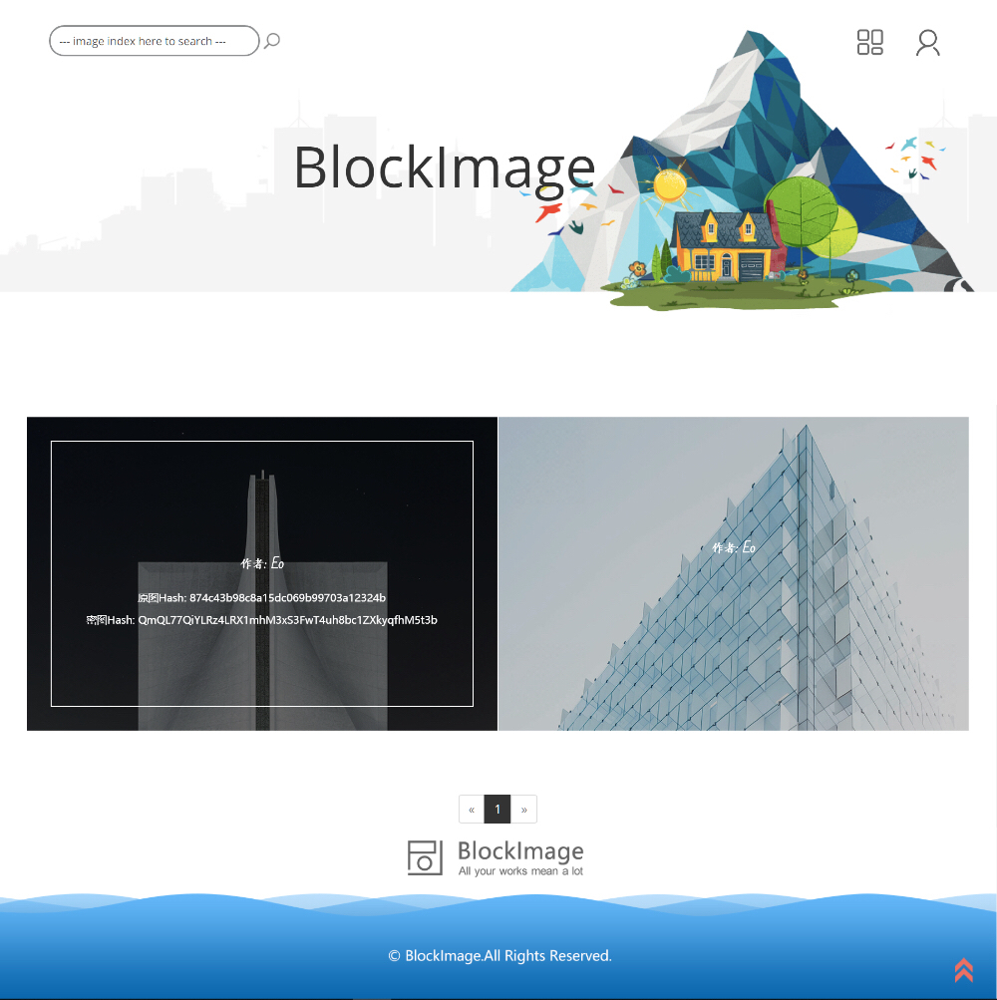
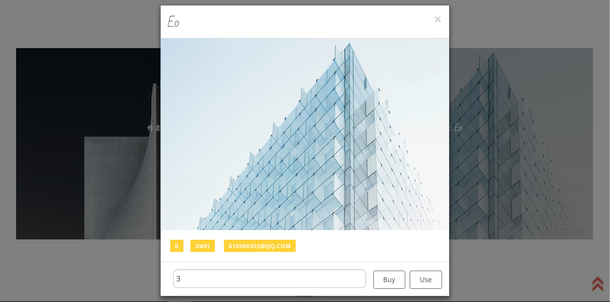

# BlockImage System
Team Member: E0, [EP](https://github.com/LinkleYping) 
A original picture sharing system based on blockchain & digital watermark. 
We won first prize in 2018 National College Student Information Security Contest.

## Directory

1. [BlockImage_V1](https://github.com/E0HYL/BlockImage_System/tree/master/BlockImage_V1): Client web page.
2. [BlockImage_V2](https://github.com/E0HYL/BlockImage_System/tree/master/BlockImage_V2): Server control web page.
3. [Blmg_SamrtContract](https://github.com/E0HYL/BlockImage_System/tree/master/Blmg_SamrtContract): Smart contract in Solidity.
4. [Processor](https://github.com/E0HYL/BlockImage_System/tree/master/Processor): Tornado based server. (encryption, sensitive hashing, digital watermark, IPFS upload...)
5. [BImgAssist](https://github.com/E0HYL/BlockImage_System/tree/master/BImgAssist): Client helper.

Notice: Server here is just a helper for user interaction (so we'd rather call it a processor), the core function is developed on blockchain and encrypted/watermarked images are stored in IPFS. 

## DApp Overview

Buy or use a image: transfer or authorize the copyright.

